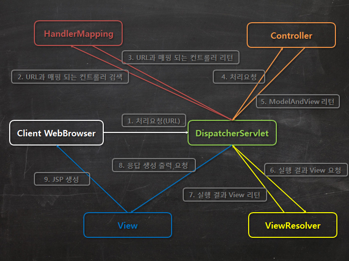

###SpringFrameWork

#####스프링의 정의
    
    자바 플랫폼을 위한 오픈소스 애플리케이션 프레임워크
    자바 엔터프라이즈 개발을 편하게 해주는 오픈 소스 경량급 애플리케이션 프레임워크
    자바 개발을 위한 프레임워크로 종속 객체를 생성해주고, 조립해주는 도구
    자바로 된 프레임워크로 자바 SE로 된 자바 객체(POJO)를 자바 EE에 의존적이지 않게 연결해주는 역할

    POJO(Plain Old Java Object) : J2EE등의 중량 프레임워크들을 사용하게 되면서 해당 프레임워크에 종속된 "무거운" 객체를 반발해서 사용되는 언어

#####스프링 특징

    크기와 부하의 측면에서 경량
    스프링은 POJO 방식의 프레임워크
    제어 역행(IoC)라는 기술을 통해 애플리케이션의 느슨한 결합을 도모
    스프링은 의존성 주입(DI)을 지원
    관점지향(AoP) 프로그래밍을 위한 풍부한 지원을 함
    스프링은 영속성과 관련한 다양한 서비스를 지원
    스프링은 확장성이 높음
    모델-뷰-컨트롤러 패턴 지원

#####DI(Dependency Injection)

    DI는 예를 들어, 스마트폰과 배터리가 있을 때 아이폰은 일체형이지만 갤럭시는 탈부착 형태이다
    분리/부착형으로 개발되면 객체간의 결합도를 낮출 수 있다.
    코드의 재사용이 편하다.
    모의 객체등을 이용한 단위 테스트의 편의성을 높여준다.
    Construction Injection / Setter Injection이 있다.

#####IoC(Inversion of Control)

    작은 부품부터 큰 부품으로, 제품을 만드는 순서가 역순인 것.
    프레임워크에 제어의 권한을 넘기으로써 클라이언트 코드가 신경 써야 할 것을 줄이는 전략.
    고수준 모듈은 저수준 모듈의 구현에 의존해서는 안된다.

- 빈(Bean) : 스프링이 제어권을 가지고 직접 만들고 관계를 부여하는 오브젝트
- 빈 팩토리(Bean Factory) : 빈(오브젝트)의 생성과 관계 설정 제어를 담당하는 IoC오브젝트, 좀 더 확장한 애플리케이션 컨텍스트(application context)를 주로 사용
- 애플리케이션 컨텍스트 : DI를 위한 빈 팩토리에 엔터프라이즈 애플리케이션을 개발하는 데 필요한 여러 가지 컨테이너 기능을 추가한 것 (IoC 컨테이너 or 스프링 컨테이너)

#####AoP(Aspect Oriented Programming)

    주 업무가 아닌 부가적인 업무가 강한 응집력을 가지고 있는 경우, 소스 관리 및 개발 업무 진행이 복잡해지고 어려워짐
    서비스 추상화가 어려워짐. 이를 해결하기 위해서 탄생함.
    객체 간 결합도를 낮누는데 목적이 있다. 클래스들이 공통으로 갖는 기능이나 절차 등을 하나의 것으로 묶어 빼내어 별도로 관리하려는 목적.
    전체 코드 곳곳에 흩어져 있는 다양한 관심 사항이 하나의 장소로 응집됨. => 코드가 깔끔해지고  가독성이 높아짐.

- 보조 업무 코드를 주 업무 코드에서 별도로 분리하여 작성하고, 필요할 때에만 도킹하여 사용하는 것은 어떨까? 하는 발상에서 나온 개념.

#####MVC(Model View Controller)

    스프링이 제공하는 트랜잭션 처리, DI, AOP를 손쉽게 사용
    컨트롤러를 사용ㅎ여 요청을 처리한다.

######MVC 구성 요소

     
    DispatcherServlet : 클라이언트의 요청을 전달받아 요청에 맞는 컨트롤러가 리턴한 결과값을 View에 전달하여 알맞은 응답을 생성
    HandlerMapping : 클라이언트의 요청 URL을 어떤 컨트롤러가 처리할지 결정
    Controller : 클라이언트의 요청을 처리한 뒤, 결과를 DispatcherServlet에게 리턴
    ModleAndView : 컨트롤러가 처리한 결과 정보 및 뷰 선택에 필요한 정보를 담음
    ViewResolver : 컨트롤러의 처리 결과를 생성할 뷰를 결정
    View : 컨트롤러의 처리 결과 화면을 생성, JSP 또는 Velocity 템플릿 파일 등을 뷰로 사용

